# ESP32 T-Display Multifunctional Security Device

<div align="center">

**Open-source hardware security device featuring TOTP Authenticator and Password Manager with BLE Keyboard**

[](https://opensource.org/licenses/MIT)
[](https://platformio.org/)
[](https://www.espressif.com/)

[](https://www.youtube.com/watch?v=YTVQBwgok_E)
[](https://www.hackster.io/makepkg/securegen-open-source-totp-authenticator-password-manager-c350d6)
[](https://dev.to/makepkg)
[]([https://www.producthunt.com/posts/](https://www.producthunt.com/products/securegen-2)[)

[Video Demo](#-video-demo) • [Features](#-key-features) • [Installation](#-quick-start) • [Documentation](#-documentation) • [Security](#-security) • [Support](#-support)

</div>

---

## 📸 Device Gallery

### Physical Device Interface
<table>
  <tr>
    <td align="center" width="33%">
      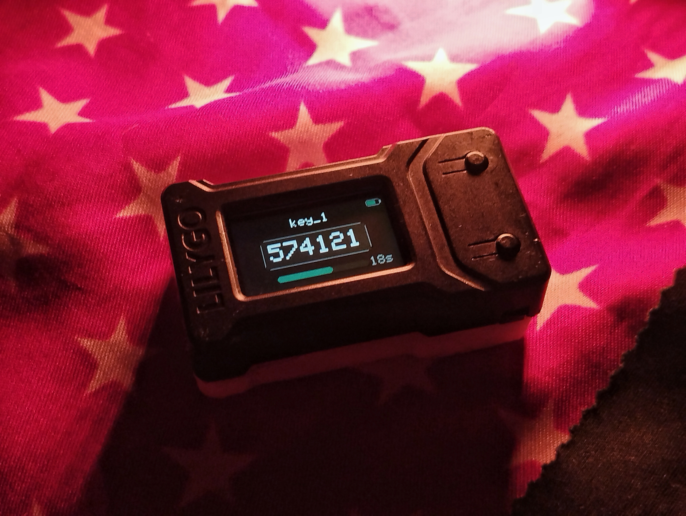
      <br/><b>TOTP Mode (Dark Theme)</b>
      <br/>Real-time authentication codes
    </td>
    <td align="center" width="33%">
      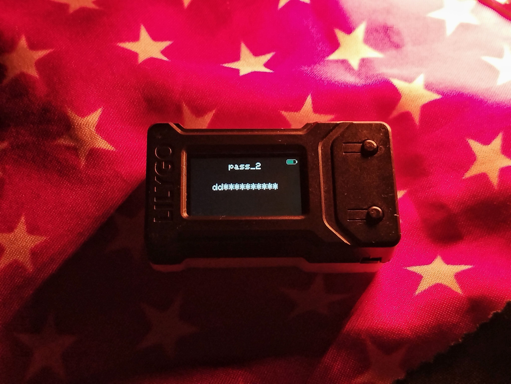
      <br/><b>Password Manager Mode</b>
      <br/>Secure offline password vault
    </td>
    <td align="center" width="33%">
      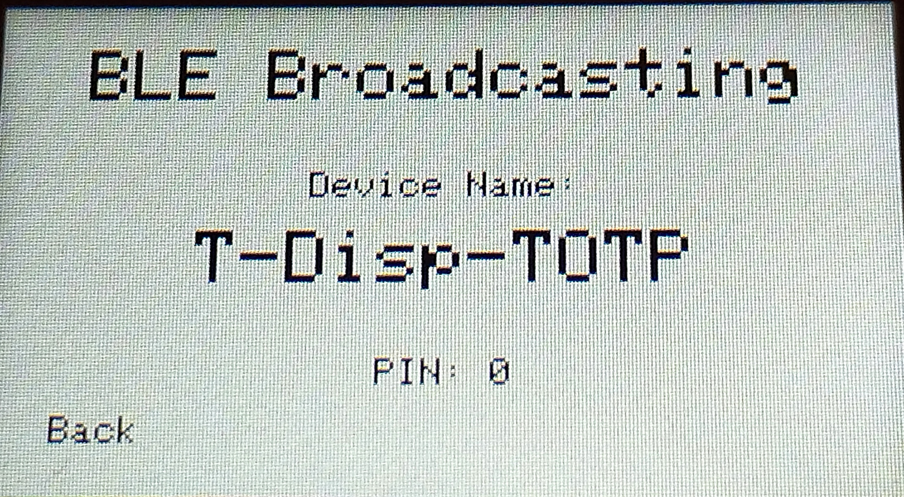
      <br/><b>BLE Security Mode</b>
      <br/>Encrypted wireless transmission
    </td>
  </tr>
  <tr>
    <td align="center" width="33%">
      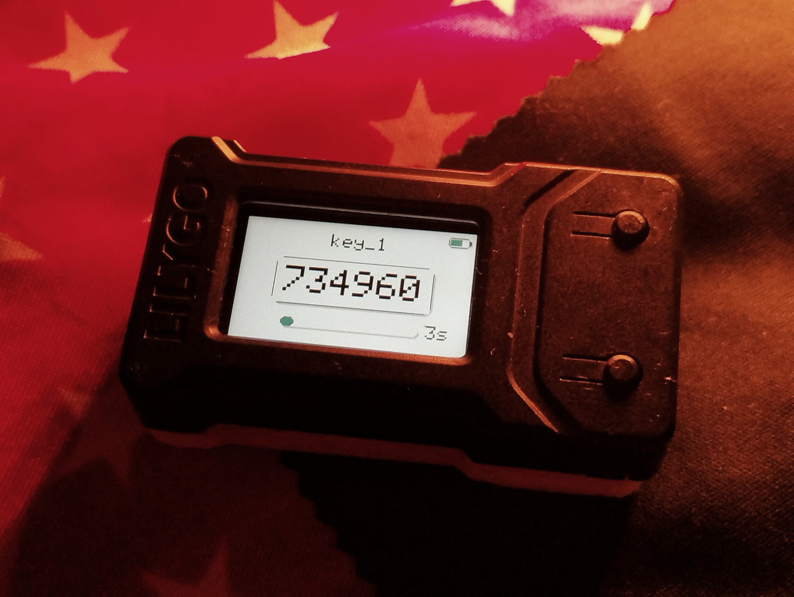
      <br/><b>Light Theme UI</b>
      <br/>Customizable display themes
    </td>
    <td align="center" width="33%">
      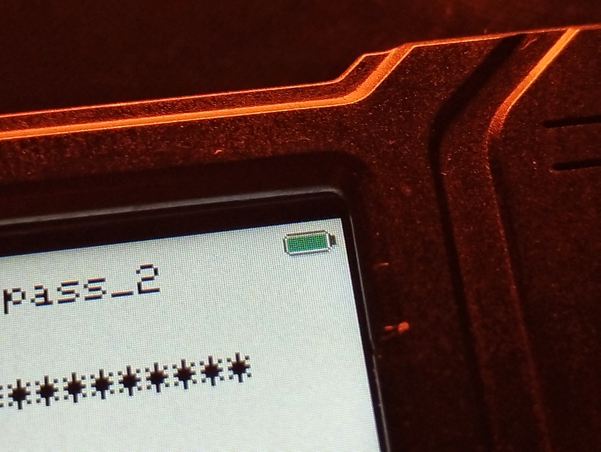
      <br/><b>Battery & Status</b>
      <br/>Real-time monitoring
    </td>
    <td align="center" width="33%">
      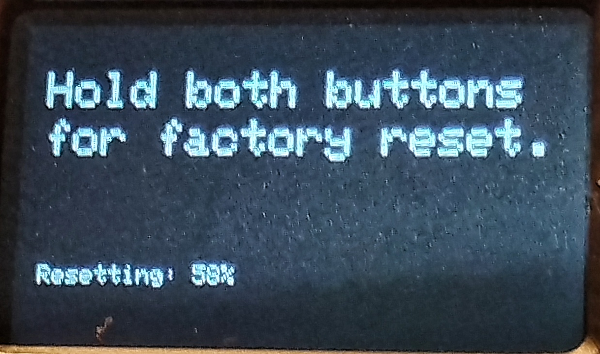
      <br/><b>Factory Reset</b>
      <br/>Secure data wiping
    </td>
  </tr>
</table>

### Web Management Interface
<table>
  <tr>
    <td align="center" width="33%">
      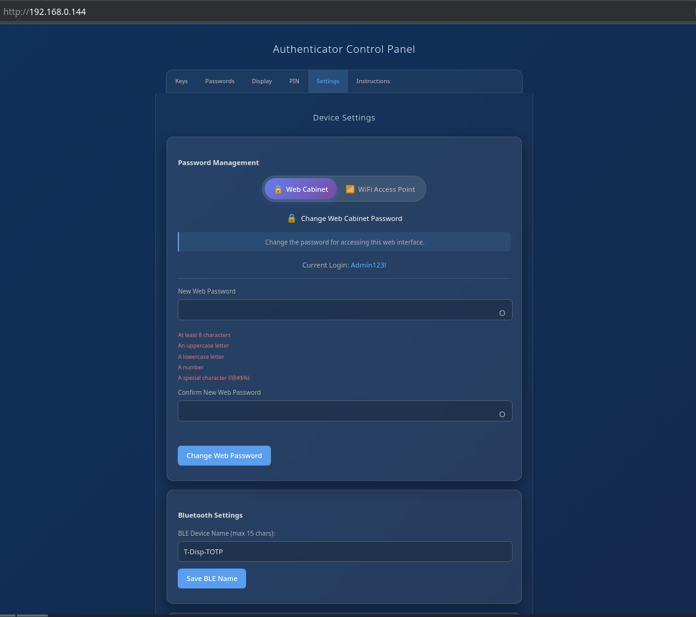
      <br/><b>Dashboard & Login</b>
      <br/>Secure web access
    </td>
    <td align="center" width="33%">
      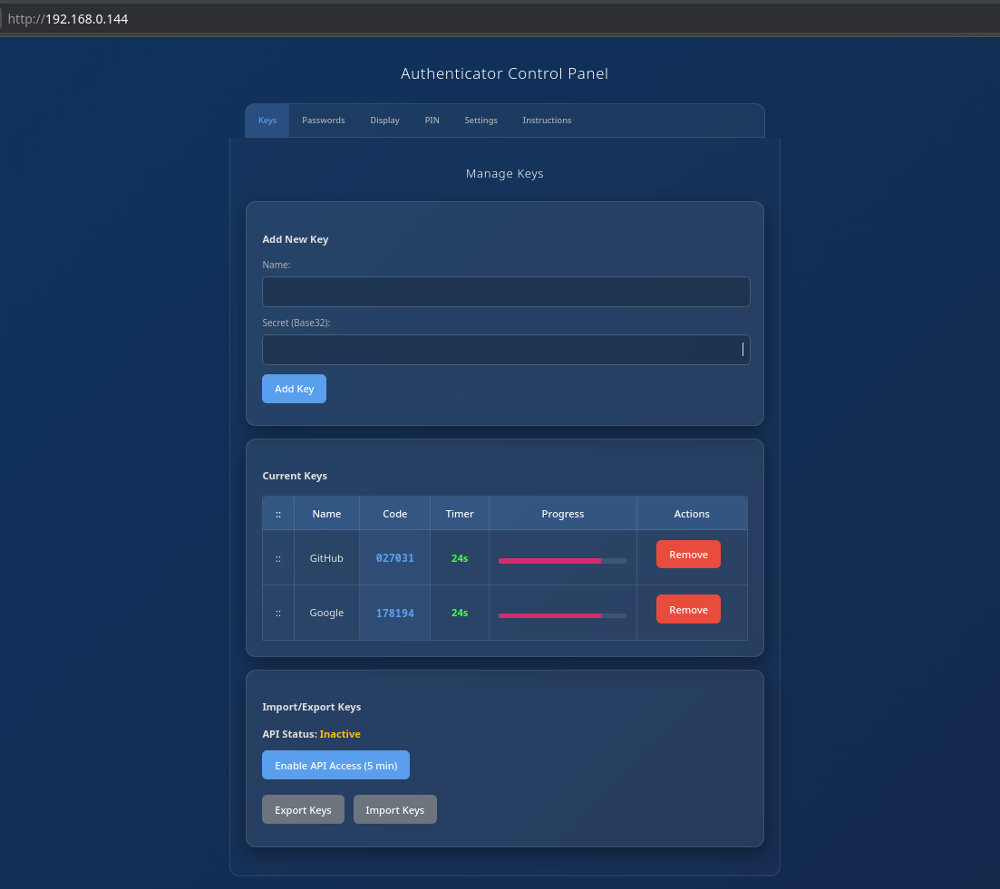
      <br/><b>TOTP Management</b>
      <br/>QR code scanning & bulk import
    </td>
    <td align="center" width="33%">
      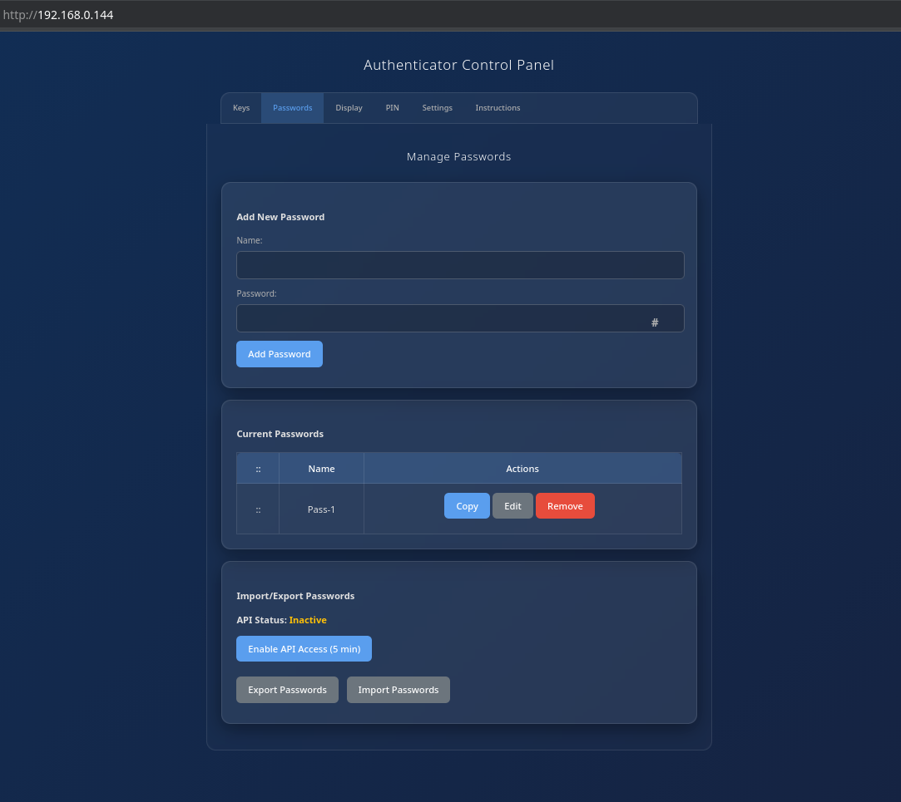
      <br/><b>Password Vault</b>
      <br/>Encrypted storage & search
    </td>
  </tr>
  <tr>
    <td align="center" width="33%">
      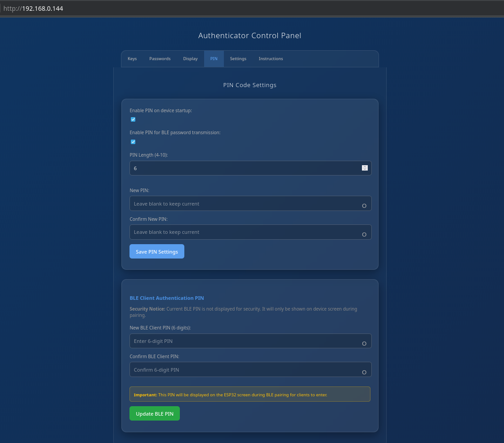
      <br/><b>Security Settings</b>
      <br/>PIN & authentication config
    </td>
    <td align="center" width="33%">
      
      <br/><b>Device Configuration</b>
      <br/>Network & display settings
    </td>
    <td align="center" width="33%">
      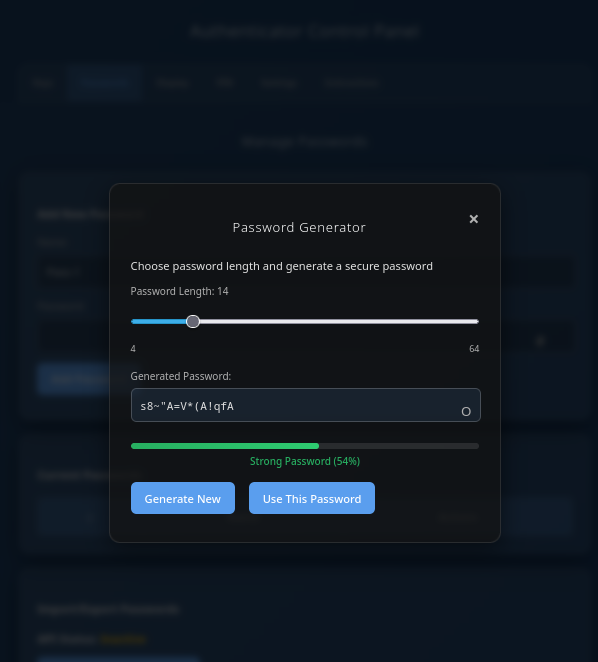
      <br/><b>Password Generator</b>
      <br/>Advanced generation & statistics
    </td>
  </tr>
</table>

---

## 🎥 Video Demo

<div align="center">

[](https://www.youtube.com/watch?v=YTVQBwgok_E)

**Watch the full demonstration** showing TOTP generation, password management, BLE keyboard typing, and web interface in action.

[▶️ Watch on YouTube](https://www.youtube.com/watch?v=YTVQBwgok_E) | Duration: 2 minutes

</div>

---

## 🔒 Security in Action

### Network Traffic Protection Visualization

SecureGen implements multiple security layers to protect web communications. Here's what that looks like in practice:

<table>
  <tr>
    <td align="center" width="50%">
      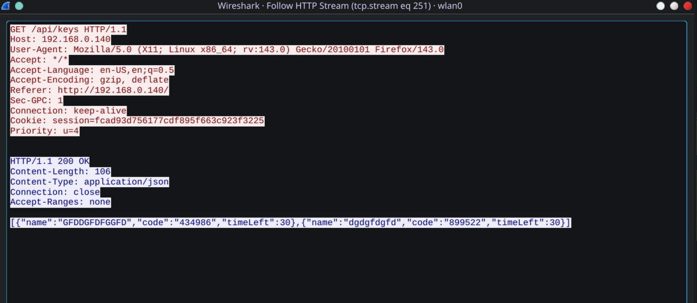
      <br/><b>Before: Readable HTTP Traffic</b>
      <br/>All request details visible in plaintext
    </td>
    <td align="center" width="50%">
      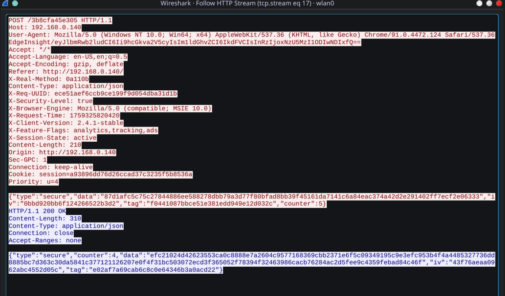
      <br/><b>After: Protected Traffic</b>
      <br/>Encrypted and obfuscated communications
    </td>
  </tr>
</table>

**What Changes:**
- **Before:** API endpoints, session cookies, and request structure are fully visible to network monitoring tools
- **After:** Multi-layer protection encrypts payload, obfuscates URLs, masks metadata, and prevents traffic analysis

This demonstrates the **7-layer security architecture** protecting your sensitive data from passive monitoring, MITM attacks, and traffic pattern analysis.

<details>
<summary><b>🔍 Technical Details (Click to Expand)</b></summary>

**Protection Layers:**

1. **Key Exchange (ECDH)** - Establishes secure session keys using elliptic curve cryptography
2. **Session Encryption** - Unique encryption for each communication session
3. **URL Obfuscation** - Dynamic API endpoints generated using cryptographic hashing
4. **Header Obfuscation** - HTTP headers dynamically mapped to hide metadata
5. **Decoy Injection** - Fake headers added to confuse traffic analysis
6. **Method Tunneling** - HTTP methods hidden to prevent fingerprinting
7. **Timing Protection** - Random delays prevent timing-based side-channel attacks

**Security Benefits:**
- Protects against passive network monitoring (Wireshark, packet sniffing)
- Prevents traffic pattern analysis and metadata leakage
- Resists MITM attacks through session-based encryption
- Anti-fingerprinting measures prevent device identification

**Performance Impact:**
- ~50ms overhead per request
- Minimal impact on user experience
- Worth the trade-off for security-critical applications

**Implementation:**
- Built with mbedTLS for cryptographic primitives
- Custom session management layer
- Hardware-accelerated encryption on ESP32
- All code available in the repository for audit

</details>

**Read more:** [Security Architecture Documentation](docs/security/SECURITY_OVERVIEW.md)

---

## ✨ Key Features

### 🔐 Security First
- **Military-Grade Encryption** - AES-256 for all sensitive data
- **Multi-Layer Protection** - 7+ security layers for web communications
- **Hardware Security** - Unique device keys from hardware entropy
- **PIN Protection** - Secure device startup and BLE transmission
- **Encrypted BLE** - Authenticated Bluetooth with bonding and MITM protection

### 🎯 Dual Functionality
- **TOTP Authenticator** - Compatible with Google Authenticator, Authy, and all standard 2FA services
- **Password Manager** - Secure offline vault with BLE keyboard transmission
- **Air-Gapped Operation** - Works completely offline for maximum security
- **Wireless Transmission** - Send passwords via encrypted Bluetooth to any device

### 🌐 Advanced Web Interface
- **Full Management** - Add, edit, delete TOTP codes and passwords remotely
- **QR Code Scanning** - Easy TOTP setup via camera or file upload
- **Password Generator** - Advanced generation with customizable complexity
- **Import/Export** - Encrypted backup with password protection
- **Custom Themes** - Light and Dark modes with custom splash screens
- **Session Security** - Automatic timeouts and secure authentication

### ⚡ Power Efficient
- **Smart WiFi** - Only active for time sync and web server
- **Light Sleep Mode** - Automatic power saving after 30 seconds
- **Battery Monitoring** - Real-time voltage and percentage display
- **Optimized Display** - Intelligent brightness control for battery life

---

## 🚀 Quick Start

### Prerequisites
- [PlatformIO IDE](https://platformio.org/platformio-ide) (VS Code extension recommended)
- LILYGO® TTGO T-Display ESP32 board
- USB-C cable for programming

### Installation

1. **Clone the repository**
   ```bash
   git clone https://github.com/Unix-like-SoN/SecureGen.git
   cd SecureGen
   ```

2. **Open in PlatformIO**
   - Launch VS Code with PlatformIO extension
   - Click "Open Project" and select the cloned folder

3. **Build and Upload**
   - Connect your T-Display board via USB
   - Click "Upload" in PlatformIO toolbar (or press `Ctrl+Alt+U`)

### First Boot Setup

1. **WiFi Configuration**
   - Device creates AP: `ESP32-TOTP-Setup`
   - Connect and navigate to `192.168.4.1`
   - Enter your WiFi credentials

2. **Security Setup**
   - Create administrator password for web interface
   - Set optional PIN code for device startup
   - Configure BLE security settings

3. **Time Synchronization**
   - Device automatically syncs time via NTP
   - Required for accurate TOTP generation

4. **Ready to Use!**
   - Device switches to normal operation
   - Access web interface at device IP address

---

## 🎮 Device Controls

### Button Operations

| Button | Action | Function |
|--------|--------|----------|
| **Button 1** (Top) | Short Press | Navigate to previous item |
| | Long Press (5s) | Switch TOTP ↔ Password Manager mode |
| **Button 2** (Bottom) | Short Press | Navigate to next item |
| | Long Press (5s) | Power off (deep sleep) |
| **Both Buttons** | 2 seconds (Password Mode) | Activate BLE keyboard transmission |
| | 5 seconds (on boot) | Factory reset (wipe all data) |

### Wake from Sleep
- After 30 seconds of inactivity, device enters light sleep
- **Press Button 2** to wake the device
- Note: Button 1 cannot wake device due to hardware limitation

---

## 🔧 Operating Modes

### Device Modes

#### 1. TOTP Authenticator Mode
- Displays service name, 6-digit code, and countdown timer
- Compatible with all standard 2FA services
- Encrypted storage with unique device key
- Real-time code generation with visual progress indicator

#### 2. Password Manager Mode
- Secure offline password vault
- Optional password masking for privacy
- BLE keyboard transmission to any device
- Advanced password generation tools
- Batch operations and secure backup

### Network Modes

#### 3. Offline Mode (Air-Gapped)
- Complete offline operation
- Maximum security through network isolation
- Password Manager works independently
- Optimized battery life with WiFi disabled

#### 4. Access Point (AP) Mode
- Device creates own WiFi hotspot
- Web interface for configuration
- Isolated network environment
- Secure password access

#### 5. WiFi Client Mode (Self-Hosted)
- Connects to existing network
- Always-on server application
- Accessible to trusted devices
- Perfect for home/team deployment
- Functions like Bitwarden or KeeWeb with dedicated hardware

#### 6. BLE Security Mode
- PIN authentication on connecting device
- Encrypted transmission with MITM protection
- Device bonding for trusted connections
- Automatic timeout after transmission

---

## 🛡️ Security

### Multi-Layer Protection System

This device implements **7+ layers of security** for protecting your sensitive data:

**Layer 1: Key Exchange**
- Elliptic Curve Diffie-Hellman (ECDH) with P-256 curve
- Establishes secure session keys
- Forward secrecy protection

**Layer 2: Data Encryption**
- Session-based encryption for all communications
- Unique encryption per message
- Replay protection with message counters

**Layer 3: URL Obfuscation**
- Dynamic API endpoint paths
- SHA-256 based generation
- Rotates on device reboot

**Layer 4: Header Obfuscation**
- Dynamic HTTP header mapping
- Hides sensitive metadata
- Regenerated on each boot

**Layer 5: Fake Header Injection**
- Adds decoy headers to confuse traffic analysis
- Mimics browser behavior
- Random values per request

**Layer 6: Method Tunneling**
- HTTP method obfuscation
- All requests appear as POST
- Additional protocol-level protection

**Layer 7: Anti-Timing Analysis**
- Random delays in cryptographic operations
- Prevents timing-based attacks
- Masks operation patterns

**Plus:** CSRF protection, session management, rate limiting, and more.

### Data Protection

**Encryption at Rest:**
- AES-256 encryption for all sensitive data
- Unique device keys from hardware parameters
- Hardware-accelerated cryptography
- Secure key derivation (PBKDF2-HMAC-SHA256)

**Physical Security:**
- PIN protection for device startup (4-10 digits)
- Secure boot support
- Factory reset with secure data wiping
- Memory protection against leakage

**Bluetooth Security:**
- LE Secure Connections with MITM protection
- AES-128 encryption (BLE standard)
- PIN-based pairing
- Device bonding for trusted connections

**For detailed security information:**
- [Security Overview](docs/security/SECURITY_OVERVIEW.md) - Public security documentation
- [Security Best Practices](#-security-best-practices) - User recommendations

---

## 📦 Hardware Requirements

### Primary Components
- **Board:** [LILYGO® TTGO T-Display ESP32](https://www.lilygo.cc/products/t-display)
- **Display:** 1.14" ST7789 TFT (135x240 pixels)
- **Battery:** Li-Po battery with JST connector (recommended ≥500mAh)
- **Connectivity:** WiFi 802.11 b/g/n + Bluetooth 5.0 LE

### Technical Specifications
- **Processor:** ESP32 dual-core Xtensa LX6 @ 240MHz
- **RAM:** 520KB SRAM with intelligent memory management
- **Storage:** 4MB Flash with wear-leveling filesystem
- **Security:** Hardware-accelerated AES encryption
- **Power:** Optimized for battery operation with multiple sleep modes
- **Temperature:** -40°C to +85°C industrial grade

---

## 📚 Documentation

### User Guides
- [Complete User Manual](docs/README.md) - Comprehensive usage guide
- [Security Overview](docs/security/SECURITY_OVERVIEW.md) - Security features and best practices
- [Feature Documentation](docs/features/) - Detailed feature descriptions
- [Troubleshooting Guide](docs/fixes/) - Common issues and solutions

### Developer Resources
- [Development Guide](docs/development/) - Build and development instructions
- [Security Architecture](docs/security/) - Security implementation details

### Recent Updates
- [Battery Power Stability Fix](docs/fixes/battery-reboot-fix-ru.md) - PIN entry optimization
- [Display Initialization Fix](docs/fixes/) - Screen initialization improvements

---

## 🔐 Security Best Practices

### Recommended Security Measures

**Network Security**
- Use strong WiFi passwords (WPA3 if available)
- Consider network isolation for the device
- Regularly update firmware through web interface
- Monitor access logs for suspicious activity

**Physical Security**
- Keep device physically secure when not in use
- Enable PIN protection for startup
- Use factory reset if device is compromised
- Store backup files in encrypted storage

**Data Management**
- Regularly export encrypted backups
- Use strong administrator passwords
- Change PIN codes periodically
- Log out from web sessions when finished

**BLE Security**
- Only pair with trusted devices
- Remove old bonded devices periodically
- Use PIN protection for BLE transmission
- Monitor BLE connection status

---

## 🌐 Community & Resources

### Stay Connected

- **📺 YouTube**: [Demo Videos & Tutorials](https://www.youtube.com/watch?v=YTVQBwgok_E)
- **📝 Dev.to**: [Technical Articles](https://dev.to/makepkg)
- **🐦 Twitter/X**: [@makepkg](https://x.com/makepkg_)

### Featured On

- 🏆 Product Hunt - [Launch Page](https://www.producthunt.com/products/securegen-2)
- 📰 Hackster.io - [Featured Project](https://www.hackster.io/makepkg/securegen-open-source-totp-authenticator-password-manager-c350d6)
- ✍️ Dev.to - [Technical Series](https://dev.to/makepkg)

### Share Your Build

Built your own SecureGen? We'd love to see it!
- Tag us on social media
- Submit to [Discussions](https://github.com/makepkg/SecureGen/discussions)
- Share photos in the community

---

## 🤝 Support

### Get Help
- **Issues:** [GitHub Issues](https://github.com/makepkg/SecureGen/issues)
- **Discussions:** [GitHub Discussions](https://github.com/makepkg/SecureGen/discussions)
- **Documentation:** [Project Wiki](docs/)

### Contributing
Contributions are welcome! Please read our [Contributing Guidelines](CONTRIBUTING.md) before submitting pull requests.

### Sponsorship & Donations

If you like this project and want to support its development, you can do so in the following ways:

**GitHub Sponsors:**

[](https://github.com/sponsors/makepkg)

**Cryptocurrency Donations:**

- **TetherUSD (USDT) BEP-20** (Binance Smart Chain):
  ```
  0x4f85f29892b261fa8029f3cfd64211e166744733
  ```

- **TetherUSD (USDT) TRC-20** (Tron):
  ```
  TDnjDg9HxySo1J2FPSrvWQejyZ4gHKiXSJ
  ```

Your support is very important and helps continue working on open-source projects!

**⭐ Star this repository if you find it useful!**

For more ways to support, see [SUPPORT.md](SUPPORT.md).

---

## 📄 License

This project is licensed under the **MIT License**.

### What This Means

✅ **You can:**
- Use this software for personal or commercial purposes
- Modify the source code
- Distribute copies
- Sublicense the software
- Use it privately

⚠️ **You must:**
- Include the original copyright notice
- Include the MIT License text

❌ **You cannot:**
- Hold the author liable for any damages
- Use the author's name for endorsement without permission

For full license text, see the [LICENSE](LICENSE) file.

### Third-Party Licenses

This project uses the following open-source libraries:
- **TFT_eSPI** - FreeBSD License
- **ESPAsyncWebServer** - LGPL-3.0 License
- **AsyncTCP** - LGPL-3.0 License
- **ArduinoJson** - MIT License
- **mbedTLS** - Apache 2.0 License (included in ESP-IDF)

---

## 🙏 Acknowledgments

- ESP32 community for excellent libraries and support
- LILYGO for the T-Display hardware platform
- All contributors and users of this project

---

<div align="center">

**Made with ❤️ for the open-source community**

[⬆ Back to Top](#esp32-t-display-multifunctional-security-device)

</div>
